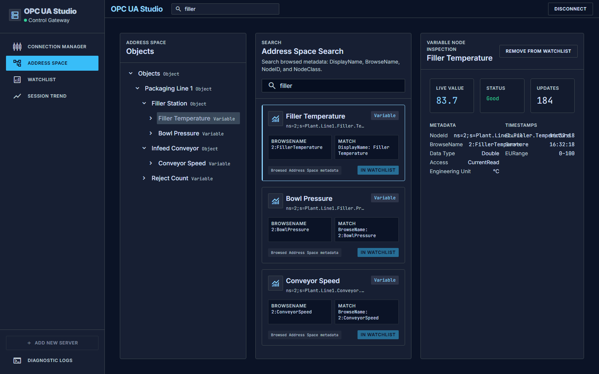
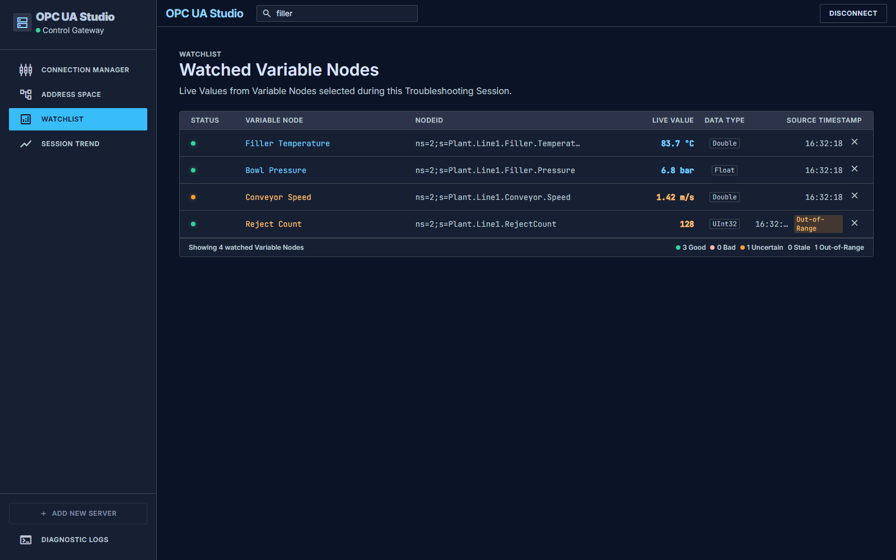
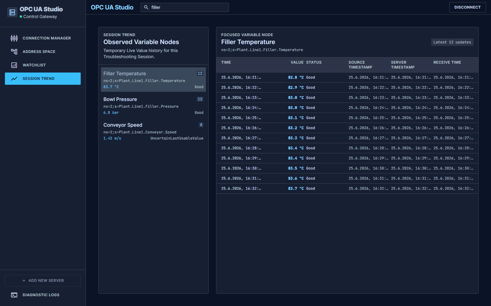
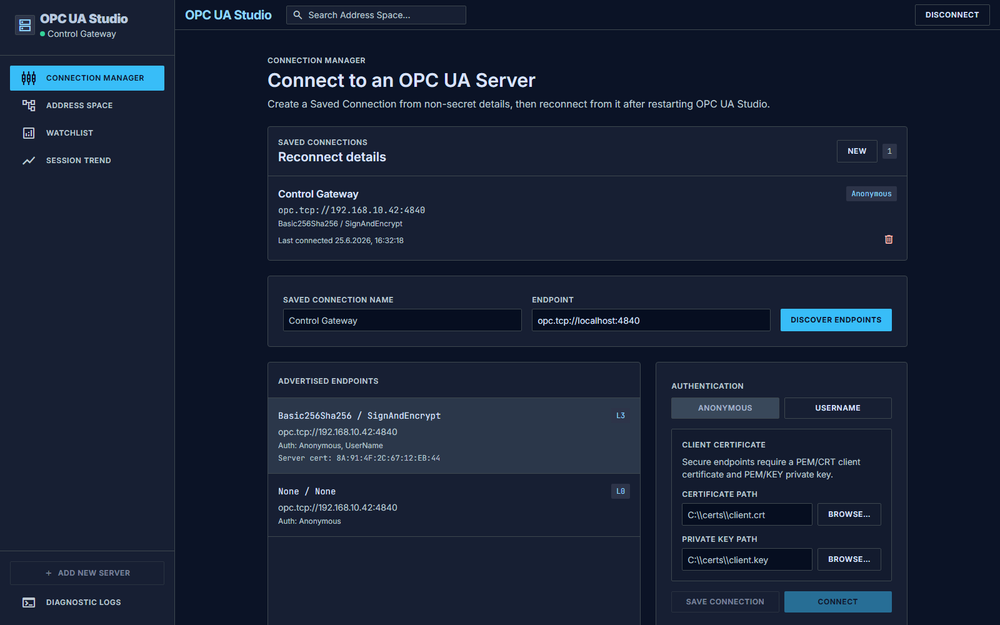

# OPC UA Studio

Desktop OPC UA client for automation engineers who need to inspect and interact with existing OPC UA Servers.



## What it does

OPC UA Studio helps automation engineers run a focused Troubleshooting Session against a live OPC UA Server:

- create Saved Connections from non-secret endpoint details
- browse the server Address Space
- search browsed Address Space metadata without expanding every branch manually
- inspect Variable Nodes with Live Value, status, timestamps, and metadata
- keep important Variable Nodes in a Watchlist
- review temporary Session Trend history from observed Live Value updates

## Features

### Search before you browse


Address Space Search finds Search Results from browsed metadata such as `DisplayName`, `BrowseName`, `NodeID`, and `NodeClass`.

### Inspect live Variable Nodes


Variable Node Inspection combines the current Live Value with status, timestamps, engineering unit, range metadata, stale state, and out-of-range state.

### Keep a troubleshooting Watchlist



The Watchlist keeps selected Variable Nodes visible during the current Troubleshooting Session, including status, Live Value, data type, and source timestamp.

### Review Session Trend updates



Session Trend shows temporary Live Value history for Observed Variable Nodes during the current Troubleshooting Session. It is not a historian.

### Manage Saved Connections



Saved Connections store reconnect details without storing passwords.

## Development

### Requirements

- Go
- Node.js
- Wails CLI

### Run locally

```sh
wails dev
```

### Build

```sh
wails build
```

### Regenerate README screenshots

README screenshots are generated from the actual Svelte app in deterministic screenshot mode.

```sh
cd frontend
npm run screenshots:readme
```

This writes images to `docs/assets/readme/`.

## Project docs

- [`CONTEXT.md`](./CONTEXT.md) — project language and domain model
- [`docs/adr`](./docs/adr) — architectural decisions
