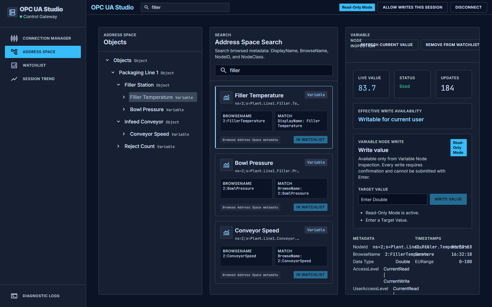
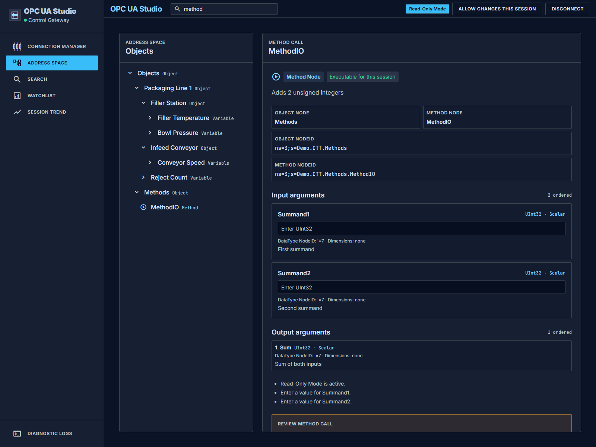
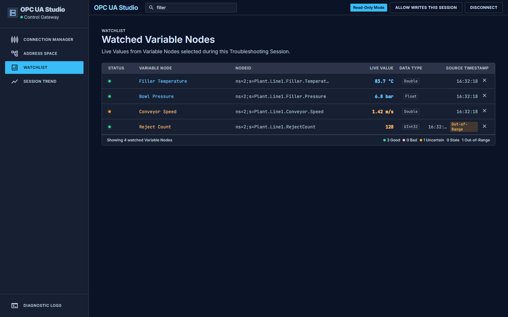
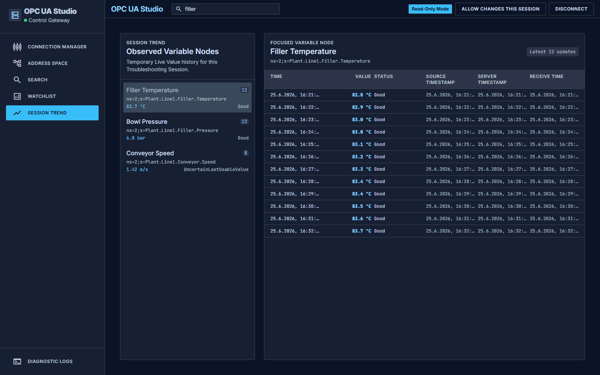
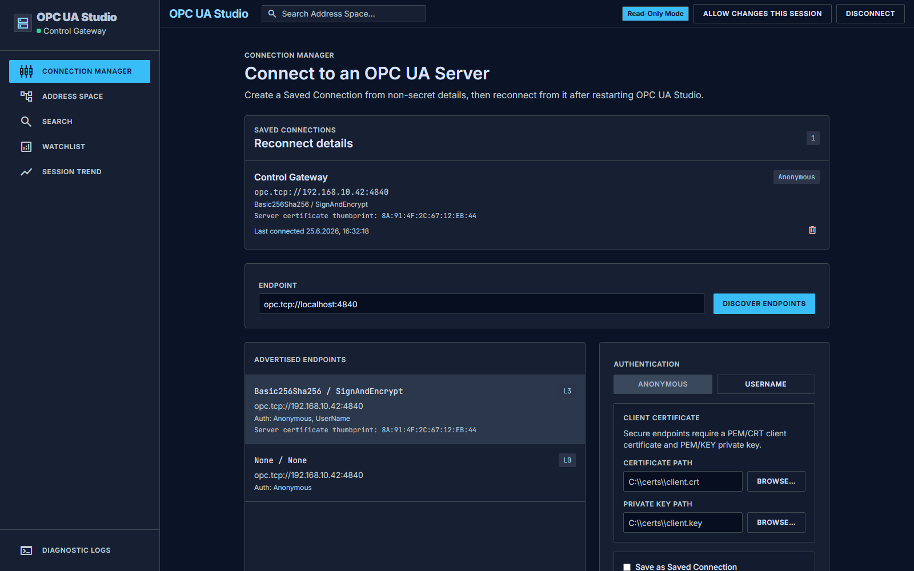

# OPC UA Studio

Desktop OPC UA client for automation engineers who need to inspect and interact with existing OPC UA Servers.


## What it does

OPC UA Studio helps automation engineers run a focused Troubleshooting Session against a live OPC UA Server:

- create Saved Connections from non-secret endpoint details
- browse the server Address Space
- search browsed Address Space metadata without expanding every branch manually
- inspect Variable Nodes with Live Value, status, timestamps, and metadata
- keep important Variable Nodes in a Watchlist
- review temporary Session Trend history from observed Live Value updates
- deliberately write one supported scalar value to one writable Variable Node when Read-Only Mode is disabled
- inspect and call discovered Method Nodes with supported scalar inputs when Read-Only Mode is disabled

## Features

### Search before you browse


Address Space Search finds Search Results from browsed metadata such as `DisplayName`, `BrowseName`, `NodeID`, and `NodeClass`.

### Inspect live Variable Nodes



Variable Node Inspection combines the current Live Value with status, timestamps, engineering unit, range metadata, stale state, and out-of-range state. OPC UA Studio starts each session in Read-Only Mode. After explicitly allowing changes for the connected session, Variable Node Write can change one supported scalar value on one writable Variable Node from the inspection view, requires confirmation, and refreshes the current value with a read-back result.

### Inspect and call Methods



Selecting a discovered Method Node opens its Method Call panel with the owning Object Node, executable state, and ordered input/output metadata. Calls require leaving Read-Only Mode and an explicit click after reviewing the target and inputs. Supported scalar inputs are Boolean, String, signed and unsigned integers, Float, and Double. Arrays, matrices, optional or null values, structures, custom DataTypes, and other built-in DataTypes are displayed but cannot be entered in v1. Returned StatusCodes and output arguments are shown as raw values.

### Keep a troubleshooting Watchlist



The Watchlist keeps selected Variable Nodes visible during the current Troubleshooting Session, including status, Live Value, data type, and source timestamp.

### Review Session Trend updates



Session Trend shows temporary Live Value history for Observed Variable Nodes during the current Troubleshooting Session. It is not a historian.

### Manage Saved Connections



Saved Connections store reconnect details without storing passwords.

## Development

### Requirements

- Go
- Node.js
- Wails CLI

### Run locally

```sh
wails dev
```

### Build

```sh
wails build
```

### Regenerate README screenshots

README screenshots are generated from the actual Svelte app in deterministic screenshot mode.

```sh
cd frontend
npm run screenshots:readme
```

This writes images to `docs/assets/readme/`.

### Validate Method calls against the demo server

The opt-in integration test uses the Unified Automation C++ demo server at `opc.tcp://localhost:48010`. Start that server, then run:

```sh
TERMUA_METHOD_TEST_ENDPOINT=opc.tcp://localhost:48010 go test ./internal/opcua -run Method -count=1 -v
```

The tracer inspects the input-only, output-only, and no-argument signatures exposed below `ns=3;s=Demo.CTT.Methods`. It executes only the known `MethodIO` tracer (`ns=3;s=Demo.CTT.Methods.MethodIO`), sending UInt32 values `20` and `22` and requiring `StatusGood` with `uint32(42)`.

Anonymous connections using SecurityPolicy None are sufficient for this tracer. Some vendor demo Methods expose argument properties only over a secure channel and return `BadSecurityModeInsufficient` over None; OPC UA Studio reports those metadata failures rather than treating them as empty signatures. The tracer therefore logs unreadable Methods while requiring a readable example of each empty-signature edge. This validation does not broaden v1 input DataType support.

## Project docs

- [`CONTEXT.md`](./CONTEXT.md) — project language and domain model
- [`docs/adr`](./docs/adr) — architectural decisions

## License

Apache License 2.0. See [`LICENSE`](./LICENSE).
